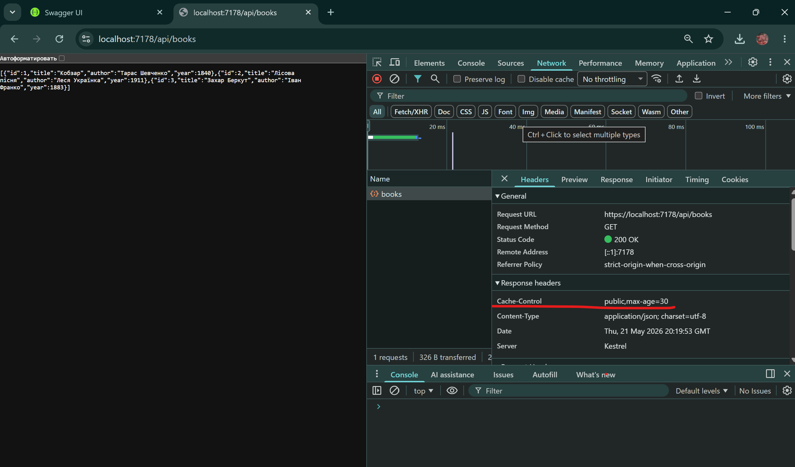

У проекті реалізовано два види кешування. InMemory зберігає дані на сервері, повторні запити отримують результат з кешу без зайвої обробки. ResponseCache каже браузеру зберігати відповідь на 30 секунд і не робити нових запитів до сервера
